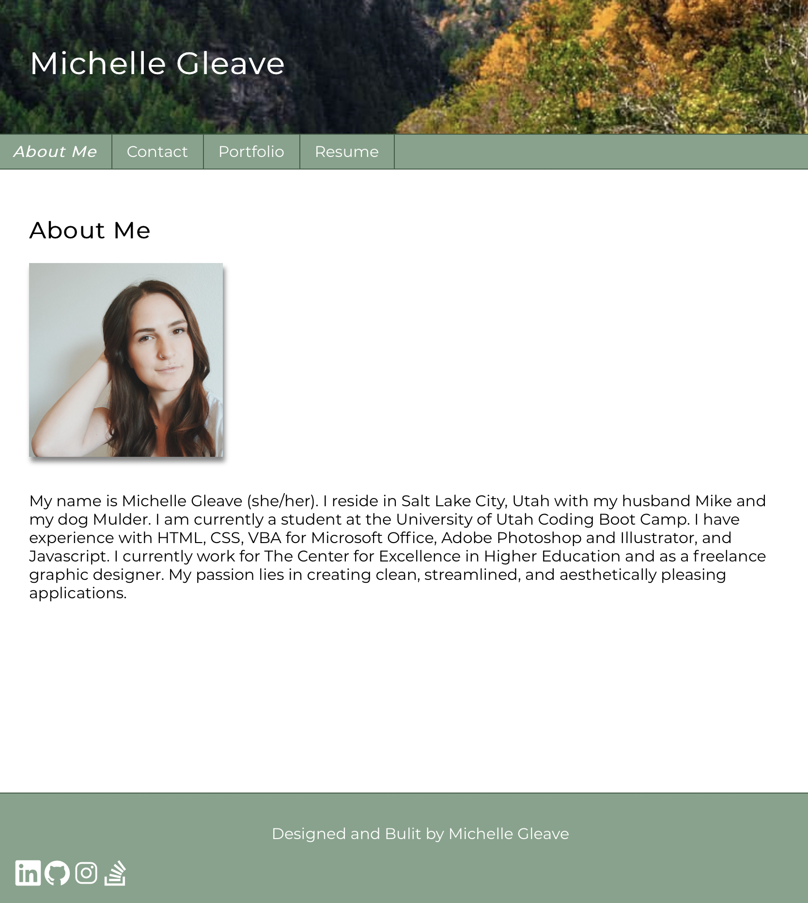
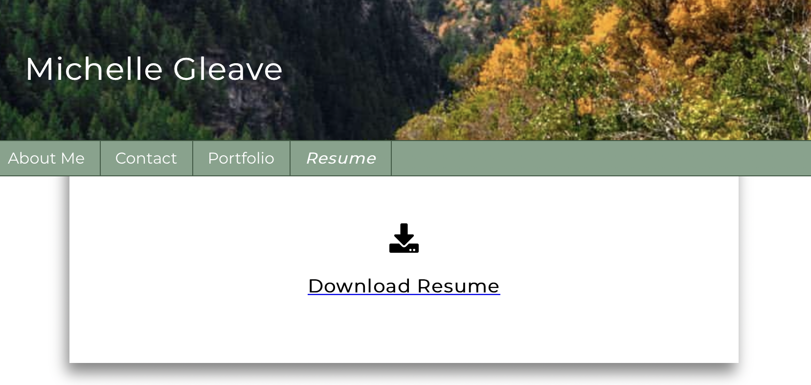
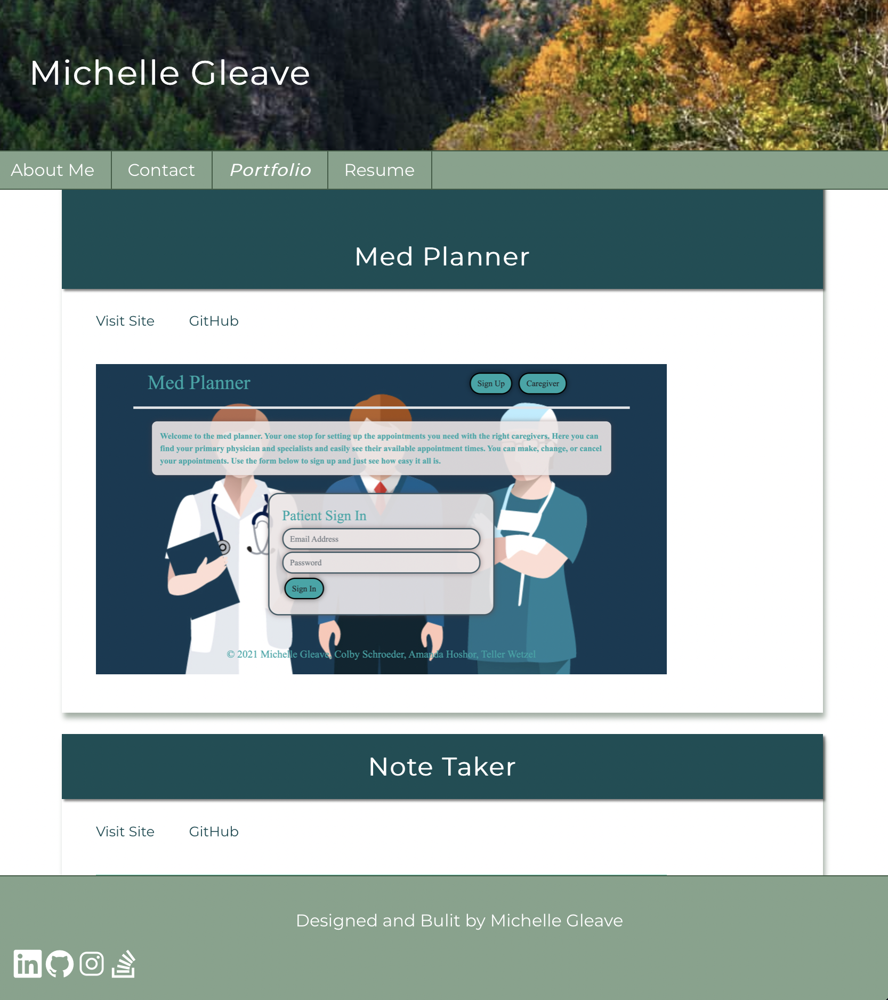
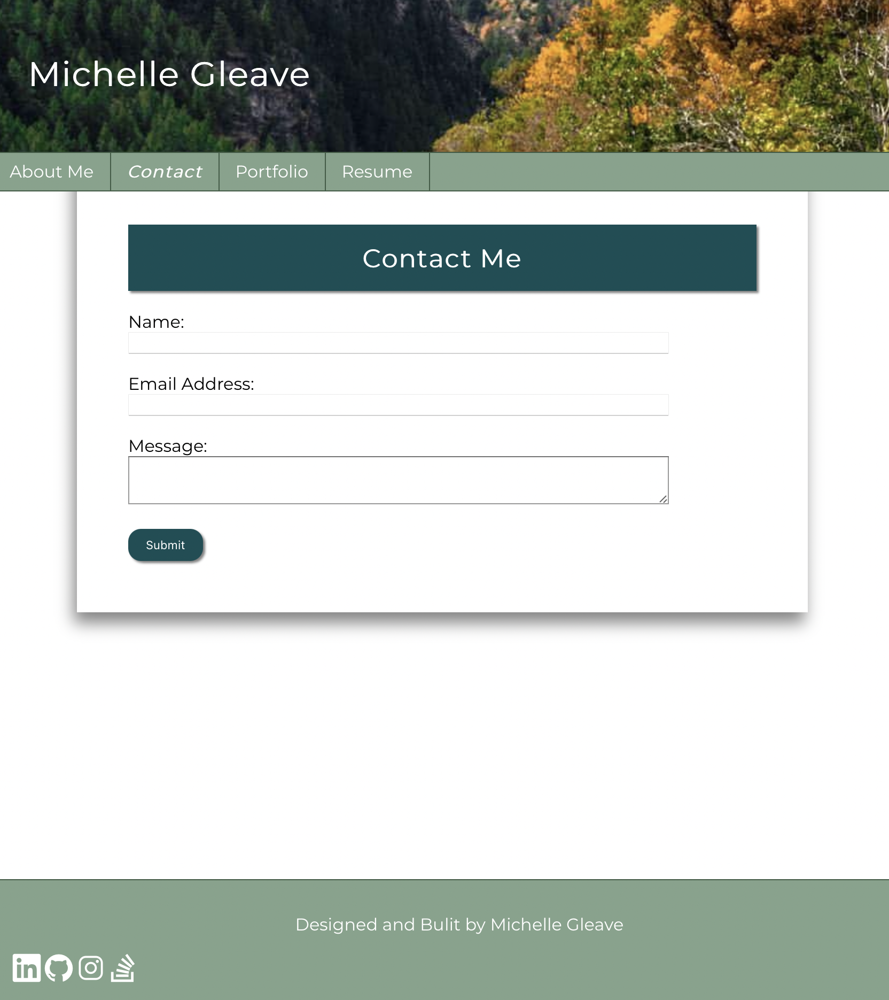

# mmgleave-portfolio-v2
Version 2 Portfolio / Built with React

## Table of Contents
[Description]($description) 
[Screenshots]($screenshots) 
[Author]($author)

## Description
### A portfolio with four sections: about me, contact, resume, and portfolio. 

- _[Visit Portfolio Website](https://mmgleave-portfolio-v2.netlify.app/)_

- _[View Project on GitHub](http://github.com/mmgleave/mmgleave-portfolio-v2)_

## Screenshots

## Author
### Michelle Gleave 
_Visit my [GitHub](https://github.com/mmgleave/)_ 
_If you have any questions please feel free to reach out to me at: <a href='mailto:mmgleave@gmail.com.com'></i>My Email</a>_
